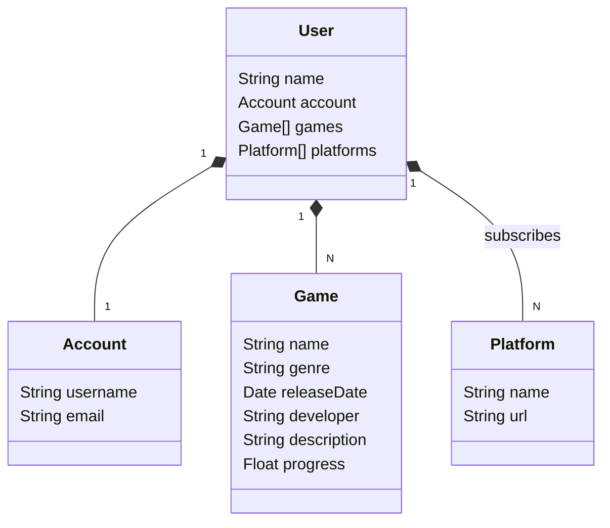

## Diagrama de Classe

```mermaid
classDiagram
    class User {
        String name
        Account account
        Game[] games
        Platform[] platforms
    }

    class Account {
        String username
        String email
    }

    class Game {
        String name
        String genre
        Date releaseDate
        String developer
        String description
        Float progress
    }

    class Platform {
        String name
        String url
    }

    User "1" *-- "1" Account
    User "1" *-- "N" Game
    User "1" *-- "N" Platform : subscribes

```
