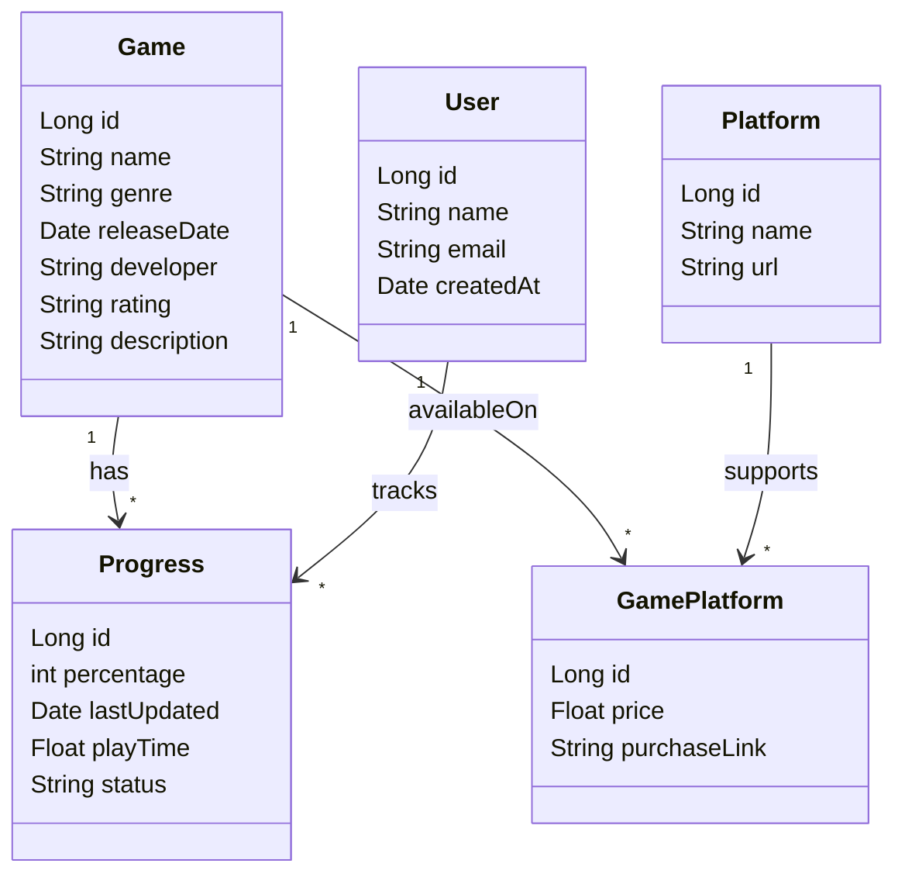

## Diagrama de Classe

```mermaid
classDiagram
    class Game {
        Long id
        String name
        String genre
        Date releaseDate
        String developer
        String rating
        String description
    }

    class Platform {
        Long id
        String name
        String url
    }

    class Progress {
        Long id
        int percentage
        Date lastUpdated
        Float playTime
        String status
    }

    class User {
        Long id
        String name
        String email
        Date createdAt
    }

    class GamePlatform {
        Long id
        Float price
        String purchaseLink
    }

    Game "1" --> "*" Progress : has
    Game "1" --> "*" GamePlatform : availableOn
    Platform "1" --> "*" GamePlatform : supports
    User "1" --> "*" Progress : tracks
```
