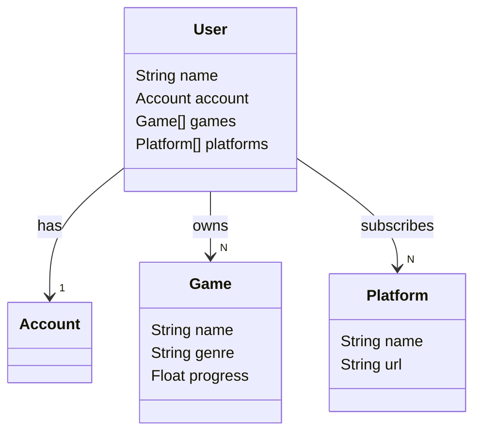

## Diagrama de Classe

```mermaid
classDiagram
    class User {
        String name
        Account account
        Game[] games
        Platform[] platforms
    }

    class Game {
        String name
        String genre
        Float progress
    }

    class Platform {
        String name
        String url
    }

    User --> "1" Account : has
    User --> "N" Game : owns
    User --> "N" Platform : subscribes
```
